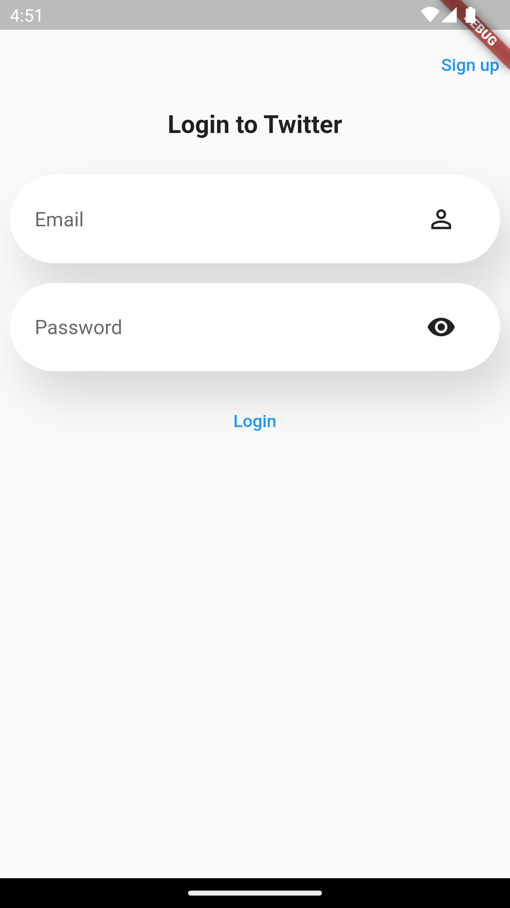
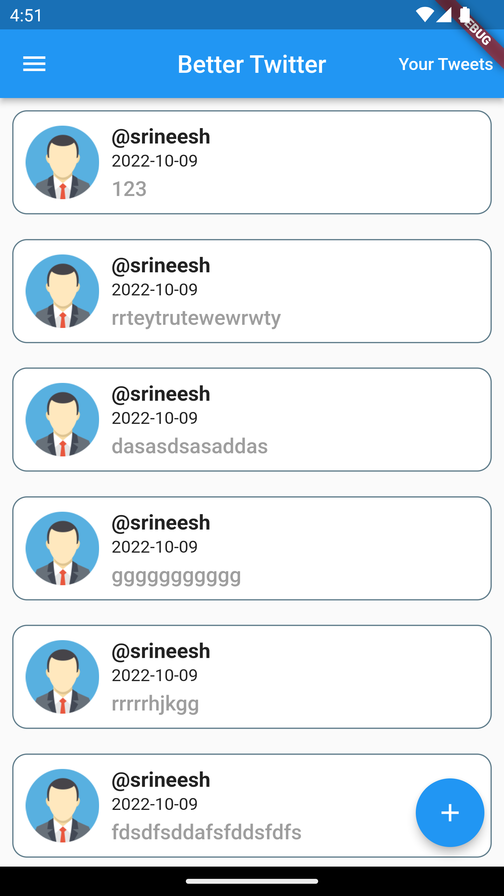
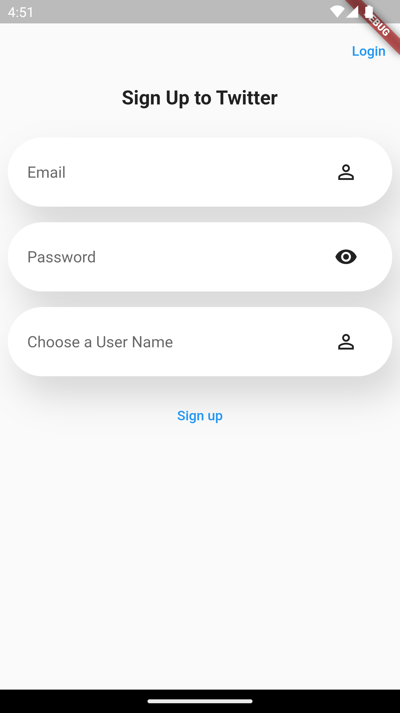
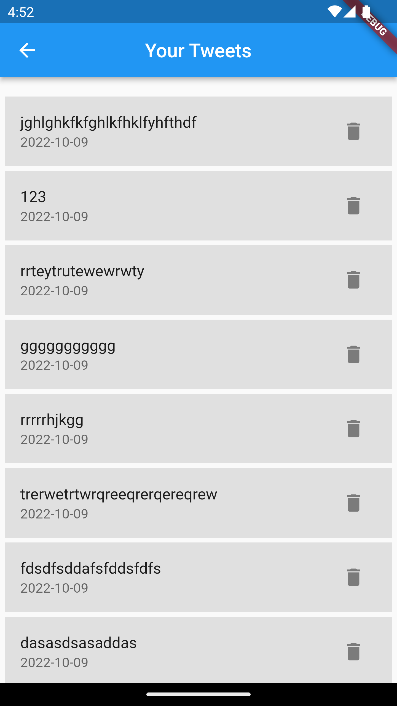

# BetterTwitter [](http://makeapullrequest.com) <a href="https://github.com/Solido/awesome-flutter">

A Simple Twitter project with posting,editing and delete functionalites built using flutter and firebase(2022).

#### Demonstrations
<div style="text-align: center"><table><tr>
  <td style="text-align: center, width: 180">
    
        
[Instant Chat Integration](https://getstream.io/chat/sdk/flutter/?utm_source=Github&utm_medium=Github_Repo_Content_Ad&utm_content=Developer&utm_campaign=Github_Mar2022_FlutterChatSDK&utm_term=Awesome)
    
<a href="https://getstream.io/chat/sdk/flutter/?utm_source=Github&utm_medium=Github_Repo_Content_Ad&utm_content=Developer&utm_campaign=Github_Mar2022_FlutterChatSDK&utm_term=Awesome">
     
    </a>
    
[with Stream!](https://getstream.io/chat/sdk/flutter/?utm_source=Github&utm_medium=Github_Repo_Content_Ad&utm_content=Developer&utm_campaign=Github_Mar2022_FlutterChatSDK&utm_term=Awesome)
    

  </td>
   <td style="text-align: center">
    
  
    Login

  </td>
  <td style="text-align: center">
    
    home
  </td>
  <td style="text-align: center">
    
  

   Signup

  </td>
  <td style="text-align: center">
    
  

   Your tweets

  </td>


</tr></table></div>

## Pre Requisites for running the application
* Flutter v3.3.4
* Any IDE with Flutter SDK installed (ie. IntelliJ, Android Studio, VSCode etc)
* android studio installed
* Android emulator or android device.

## Commands to run the application
Use these commands in sequential order for running the application.
* Flutter get command
```
$ flutter pub get
```
* Build runner
```
$ flutter pub run build_runner build --delete-conflicting-outputs
```
*Connect a Android emulator or real device and run the application
```
$ flutter run lib/main.dart
```
You can also check the code coverage of the project using the below command
```
$ flutter test --coverage
```
