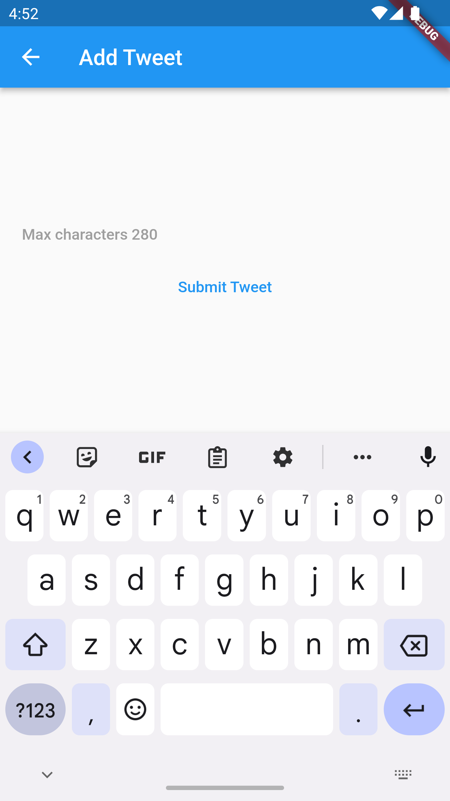

# BetterTwitter 2022 [](http://makeapullrequest.com) <a href="https://github.com/Solido/awesome-flutter">

A Simple Twitter project with posting,editing and delete functionalites built using flutter and firebase(2022).

#### App Screenshots
<div style="text-align: center"><table><tr>
  
   <td style="text-align: center">
    
    Login
  </td>
  <td style="text-align: center">
    
    home
  </td>
  <td style="text-align: center">
    
   Signup
  </td>
  <td style="text-align: center">
    
   Your tweets
  </td>
  <td style="text-align: center">
    
   Add tweet
  </td>


</tr></table></div>

## Pre Requisites for running the application
* Flutter v3.3.4
* Any IDE with Flutter SDK installed (ie. IntelliJ, Android Studio, VSCode etc)
* android studio installed
* Android emulator or android device.

## Commands to run the application
Use these commands in sequential order for running the application.
* Flutter get command
```
$ flutter pub get
```
* Build runner
```
$ flutter pub run build_runner build --delete-conflicting-outputs
```
*Connect a Android emulator or real device and run the application
```
$ flutter run lib/main.dart
```
You can also check the code coverage of the project using the below command
```
$ flutter test --coverage
```

## Key requirements of the application
- Type in a tweet with 280 characters limit
- Save this along with the current time into Firestore
- View a list of all tweets by all users, sorted by most recent date
- The app should update in realtime when the data changes on Firestore.
- Edit a tweet written by the author
- Delete tweets written by the author
- Sign-out functionality

